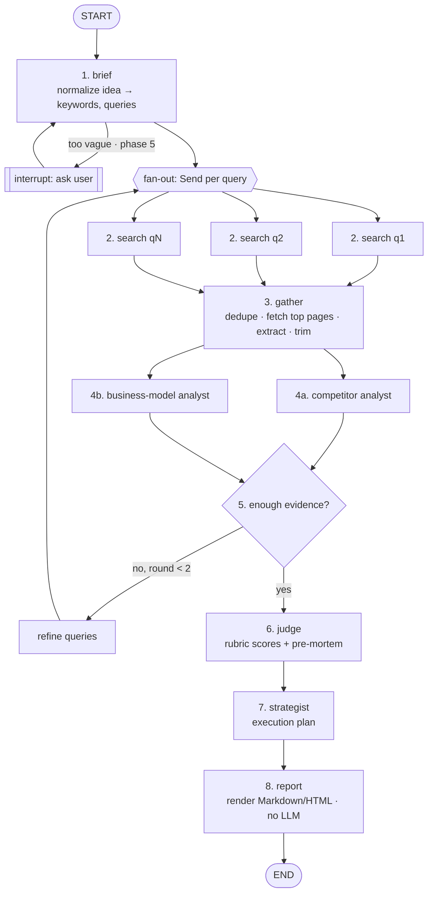

# IdeaToDeck — Project Plan

> Type an idea. Get back: does it already exist, how do similar businesses make money,
> is it worth pursuing (scored, with evidence), and how to execute it.
> It should cost about a cent per run and run on a small VPS.

Status: **v0.1 built** (phases 0–2 and 4 done; see §9) · Last updated: 2026-10-09

---

## 1. Goals and non-goals

**Goals**

1. Accept any free-text idea ("an app that tells you when your houseplants need water").
2. **Existence check:** find existing products, startups and open-source projects, and say how close they are.
3. **Business model analysis:** how comparable players make money (pricing, model, market signals).
4. **Verdict:** a scorecard from a fixed rubric with cited evidence and a confidence level. The score is computed in code, so the same evidence always gives the same number.
5. **Execution insights:** MVP scope, the cheapest validation test you can run this week, first customers, pricing hypothesis, 30/60/90-day plan, and the main reasons it could fail.
6. **Cheap:** about $0.02 per run by default and under $0.15 in "deep" mode. No paid platform fees.
7. **Self-hosted:** one `docker compose up` on the VPS you already have.

**Non-goals for v1**

- Multi-tenant SaaS (billing, accounts). It's a personal tool behind a password.
- Free-roaming autonomous agents. Section 3 explains why we use a mostly fixed workflow.
- Real market-size data from paid databases (Crunchbase, Statista). We use public web evidence and label estimates as estimates.

---

## 2. User flow

```
You: "Subscription box for indoor plant care kits"
  ↓  (~60–90 s, progress streamed live)
Report:
  ├─ TL;DR verdict: 58/100 · "Pivot" · confidence: medium
  ├─ Does it exist? → Yes, close matches: Bloomscape, The Sill (+ 4 more), with links
  ├─ How they make money → DTC subscriptions $X–Y/mo, upsells, B2B office plants…
  ├─ Scorecard (8 criteria, each 1–5 with a 1–2 line justification and sources)
  ├─ Why this could fail (pre-mortem)
  ├─ How to execute → wedge/differentiation, MVP, validation test, first 10 customers, pricing, 30/60/90
  └─ Sources (every claim links back)
```

Optional input: a short **founder profile** (skills, budget, hours/week, country). Without it, the "feasibility for you" criterion is scored generically.

---

## 3. Architecture

### 3.1 Why a structured graph instead of autonomous agents

Each step here is known in advance (search, analyze, judge, advise). A fixed LangGraph `StateGraph` with a few **specialist LLM nodes** is:

- **Cheaper.** No tokens go to an agent deciding what to do next, and searches and page fetches are capped in code.
- **Predictable.** Each run costs about the same, and every node has a typed input and output.
- **Easier to debug and evaluate.** Each node can be tested on its own.

We still use LangGraph's agent features where they help:
- **Parallel fan-out** (`Send`) for searches and the two analysts.
- **Conditional loop:** if the evidence is thin, run one extra research round with better queries (max 1).
- **Checkpointing** (later phase). For now, finished runs and their reports are stored in SQLite, and a run interrupted by a restart is marked failed.
- **`interrupt()`** (later phase) to ask you a clarifying question when the idea is too vague.

### 3.2 The graph



### 3.3 Nodes

| # | Node | Uses an LLM? | Default model | Output (Pydantic schema) |
|---|------|--------------|---------------|--------------------------|
| 1 | `brief` | yes | Haiku 5.5, effort `low` | `IdeaBrief`: one-liner, target user, problem, category, keywords, 5–8 search queries (competitors, "X alternative", pricing, market size, Reddit/HN demand) |
| 2 | `search` (×N in parallel) | no | — | raw results (title, url, snippet) from SearXNG, falling back to Tavily |
| 3 | `gather` | no | — | `Source[]`: deduped, top ~8 pages fetched (httpx + trafilatura), main text trimmed to about 1,500 tokens each |
| 4a | `competitor_analyst` | yes | Haiku 5.5 | `CompetitorReport`: existence verdict (`exact` / `close` / `adjacent` / `none_found`), competitors[] (name, url, what it does, pricing, traction signals, similarity 0–1), gaps, `needs_more_research`, `followup_queries` |
| 4b | `business_analyst` | yes | Haiku 5.5 | `BusinessModelReport`: how comparables monetize, candidate models for this idea, price points seen, rough unit economics, market-size signals (labeled as estimates) |
| 5 | `evidence_check` | no (rule) | — | routes to a refine round if `needs_more_research` and `round < 2` |
| 6 | `judge` | yes | Haiku 5.5 (Sonnet 5.5 in deep mode) | `Scorecard`: 8 criteria × {score 1–5, justification, source ids}, pre-mortem (top 3 ways it fails), confidence |
| 7 | `strategist` | yes | Haiku 5.5 (Sonnet 5.5 in deep mode) | `ExecutionPlan`: wedge/positioning, MVP scope, validation experiment this week, first 10 customers, pricing hypothesis, 30/60/90 days, what not to build |
| 8 | `report` | no | — | Markdown + HTML (Jinja template), overall score computed in code |

Only 4–5 LLM calls per run. Everything else is plain Python.

### 3.4 State (sketch)

```python
class IdeaState(TypedDict):
    idea: str
    profile: FounderProfile | None
    mode: Literal["cheap", "deep"]
    brief: IdeaBrief
    queries: list[str]
    sources: Annotated[list[Source], merge_sources]   # reducer: dedupe by URL
    research_round: int
    competitors: CompetitorReport
    business: BusinessModelReport
    scorecard: Scorecard
    plan: ExecutionPlan
    usage: Annotated[list[UsageRecord], operator.add]  # tokens + $ per node
    report_md: str
```

### 3.5 Prompting principles

- **Be a skeptical investor, not a cheerleader.** LLMs tend to praise ideas. The judge prompt asks for the pre-mortem *before* the scores, and every score above 3 must cite a source.
- **Existing competitors aren't automatically bad.** They prove demand. The rubric scores *differentiation*, not "no competitors". `none_found` is flagged as "either a gap or no market", never as an easy win.
- **Web content is data, not instructions.** Fetched pages go inside `<source id=…>` delimiters, and the system prompt says to ignore instructions inside them. No node has side-effecting tools, so the worst a malicious page can do is skew one report.
- **Structured outputs everywhere.** Use `with_structured_output(Schema, method="json_schema")`, not forced tool calls. Sonnet 5.5 rejects forced `tool_choice`, and `json_schema` works on both models.

---

## 4. Scoring rubric

| Criterion | Weight | What a 5 looks like |
|-----------|--------|---------------------|
| Problem pain & frequency | 15% | People complain about it often (Reddit/HN/reviews) and already pay or hack workarounds |
| Market size & growth | 10% | Large or fast-growing segment, with credible signals |
| Competition & differentiation | 15% | Demand is proven, and there's a clear gap or wedge incumbents ignore |
| Monetization clarity | 15% | Proven model in the space, with price points that support the economics |
| Distribution / go-to-market | 15% | A cheap, repeatable channel exists (community, SEO, marketplace, B2B outbound) |
| Feasibility for *you* | 15% | MVP is buildable with your skills, budget and time (uses the founder profile) |
| Timing / tailwinds | 5% | A recent change (tech, regulation, behavior) makes it possible or needed now |
| Defensibility | 10% | Network effects, data, brand, switching costs, or speed advantage |

- `overall = Σ weight × (score − 1) / 4 × 100`, computed in Python.
- Verdict bands: **≥ 70 Pursue** · **50–69 Pivot / refine** · **< 50 Drop or rethink**.
- **Confidence** (low/medium/high) comes from evidence volume and source diversity and is shown next to the score.

---

## 5. Cost design

### 5.1 Model prices (Anthropic API, per 1M tokens, checked 2026-10)

| Model | Input | Output | Role |
|-------|-------|--------|------|
| Claude Haiku 5.5 (`claude-haiku-5-5`) | $0.10 | $0.50 | default for every LLM node |
| Claude Sonnet 5.5 (`claude-sonnet-5-5`) | $2.00 | $10.00 | judge + strategist in **deep** mode only |

Haiku 5.5's price applies to prompts up to 100K tokens; above that it's 5× ($0.50 / $2.50). **Design rule: keep every call under about 30K input tokens.**

### 5.2 Estimated cost per run

| Step | In tokens | Out tokens (incl. thinking) | Cheap mode | Deep mode |
|------|-----------|-----------------------------|------------|-----------|
| brief | 1.5K | 1K | $0.0007 | $0.0007 |
| competitor analyst | 20K | 3K | $0.0035 | $0.0035 |
| business analyst | 20K | 3K | $0.0035 | $0.0035 |
| extra research round (sometimes) | 10K | 2K | $0.002 | $0.002 |
| judge | 8K | 4K | $0.003 | $0.056 (Sonnet) |
| strategist | 8K | 5K | $0.003 | $0.066 (Sonnet) |
| **LLM total** | | | **≈ $0.016** | **≈ $0.13** |
| Search (SearXNG, self-hosted) | | | $0 | $0 |

So 100 ideas a month cost **≈ $1.60 (cheap)** or **≈ $13 (deep)**, plus the VPS you already pay for. These are estimates; the app logs actual usage per node so we can check them.

### 5.3 Search providers (pluggable `SearchProvider` interface)

| Provider | Cost | Notes | Role |
|----------|------|-------|------|
| **SearXNG** (self-hosted in Docker) | $0 | Meta-search over Google/Bing/DDG/Brave etc. Upstream engines can rate-limit a VPS IP; fine at personal volume | Planned (phase 3) |
| **Tavily** | 1,000 free credits/mo (basic search = 1 credit), then $0.008/credit | LLM-friendly results, reliable | **Current provider** (v0.1) |
| Brave Search API | ~$5/1K queries, ~$5/mo free credit | Independent index | Optional |
| Claude server-side `web_search` | $10/1K searches + result tokens | Simplest, but the priciest per run | Not used |

### 5.4 Cost levers and guardrails (built in from day 1)

- **Hard caps in config:** max queries per round (8), max pages fetched (8), max tokens per page (1,500), max research rounds (2).
- **Effort `low`** on Haiku nodes. Turn it up only if evals show quality gains.
- **Caching in SQLite:** search results (keyed by query, 7-day TTL), fetched pages (keyed by URL), and full reports (keyed by normalized idea + mode). Re-running an idea is free.
- **Usage ledger:** every LLM call records tokens and $ per node and per run, shown in the report footer.
- **Monthly budget cap:** the app refuses new runs once `MONTHLY_BUDGET_USD` is reached.
- **Not worth it here:** prompt caching (system prompts are below the minimum cacheable size) and the Batch API (50% off, but async and it saves fractions of a cent). Revisit only if volume grows.
- **Local LLM (Ollama) on the VPS:** not recommended. A CPU-only VPS runs small models slowly and judges poorly, and at ~$0.02/run the API is cheaper than upgrading the server. The model factory still lets us switch providers through config.

---

## 6. Tech stack

| Concern | Choice | Why |
|---------|--------|-----|
| Language / packaging | Python 3.12 + `uv` | LangGraph's main ecosystem; fast reproducible installs |
| Orchestration | `langgraph` 1.2.x, run as a **library** | No LangGraph Platform/Cloud fees |
| LLM client | `langchain-anthropic` 1.7.x (`ChatAnthropic`) | Supports `effort`, structured outputs and Claude 5.5 models |
| Schemas | Pydantic v2 | Typed node I/O and structured outputs |
| Search | SearXNG (Docker) + `tavily-python` fallback | Free primary search plus a reliable fallback |
| Page extraction | `httpx` (async) + `trafilatura` | Fast, extracts the main text, fewer tokens |
| Persistence | SQLite app tables (users, runs, search cache, waitlist) | Zero-ops, a single file to back up |
| API / UI | FastAPI + one HTML page (vanilla JS + SSE for live node progress) | Tiny footprint, no JS build step |
| CLI | `argparse` (`idea-eval run "…" --deep`, `idea-eval users …`) | Fast dev loop, no extra dependency |
| Config | `pydantic-settings` + `.env` | Models, caps and keys in one place |
| Observability | Structured logs + usage ledger; LangSmith optional (free tier) | No extra cost |
| Tests | `pytest` with recorded fixtures (no live LLM calls in CI) | Free, deterministic CI |

---

## 7. Repository layout

```
IdeaToDeck/
├─ pyproject.toml
├─ .env.example
├─ src/idea_eval/
│  ├─ config.py          # settings: models per node, caps, budget, provider keys
│  ├─ schemas.py         # IdeaBrief, Source, CompetitorReport, BusinessModelReport, Scorecard, ExecutionPlan
│  ├─ state.py           # IdeaState + reducers
│  ├─ llm.py             # model factory, usage-tracking callback, budget guard
│  ├─ scoring.py         # rubric weights, overall score, verdict, confidence (pure Python)
│  ├─ tools/
│  │  ├─ search.py       # SearchProvider protocol, SearXNG + Tavily, cache
│  │  └─ fetch.py        # async fetch + trafilatura extract + token trim
│  ├─ nodes/             # brief, search, gather, competitors, business, evidence_check, judge, strategist, report
│  ├─ prompts/           # one .md system prompt per LLM node
│  ├─ graph.py           # StateGraph wiring + run_pipeline()
│  ├─ store.py           # SQLite: runs, reports, caches, usage ledger
│  ├─ api.py             # FastAPI: POST /runs, GET /runs/{id}/events (SSE), GET /runs/{id}
│  ├─ cli.py
│  └─ templates/         # report.md.j2, report.html.j2, index.html
├─ deploy/
│  ├─ docker-compose.yml # app + searxng (+ caddy)
│  ├─ Caddyfile          # automatic HTTPS
│  └─ searxng/settings.yml
├─ evals/
│  ├─ ideas.yaml         # known ideas with expected existence verdicts
│  └─ run_evals.py
└─ tests/
```

---

## 8. Hosting on your VPS

```
            Internet (HTTPS)
                  │
           ┌──────▼──────┐
           │    Caddy    │  auto TLS (Let's Encrypt)
           └──────┬──────┘
                  │ :8000 (internal network)
           ┌──────▼──────┐        ┌─────────────┐
           │  app        │ ─────► │  SearXNG    │ (internal only, never exposed)
           │  FastAPI +  │        └─────────────┘
           │  LangGraph  │ ─────► Anthropic API, Tavily (fallback)
           └──────┬──────┘
                  │
            ./data/app.db  (SQLite volume, nightly backup)
```

- **Resources:** about 500 MB RAM total (app ≈ 250 MB, SearXNG ≈ 150 MB, Caddy ≈ 30 MB). Any 1 vCPU / 1–2 GB VPS works.
- **If you already run Nginx or Traefik,** the installer skips Caddy and binds the app to 127.0.0.1:8000 for your proxy.
- **Secrets** live in `.env` on the VPS (chmod 600) and are never committed.
- **Deploys:** `git pull && docker compose up -d --build`. A GitHub Action over SSH can come later.
- **Backups:** nightly `sqlite3 app.db ".backup …"` via cron.
- **Security:** whitelist login with scrypt-hashed passwords, rate-limited login, per-user quotas and an optional global budget cap (protects your API budget), strict CSP, noindex headers.

---

## 9. Milestones

| Phase | Deliverable | Done when |
|-------|-------------|-----------|
| ✅ **0. Skeleton** | `uv` project, config, schemas, CLI, graph with stub nodes, CI with pytest | `idea "test"` runs end-to-end with fake data |
| ✅ **1. MVP (CLI)** | brief → search (Tavily free tier first, fastest to start) → gather → competitor analyst → judge → strategist → Markdown report | A real idea produces a useful report in under 2 minutes for under $0.03 |
| ✅ **2. Full graph** | business analyst in parallel, evidence check + refine loop, SQLite caches, usage ledger, budget cap, scoring in code | Cost per run is logged; a re-run of the same idea is free |
| **3. Self-hosted search** | SearXNG in Docker as primary, Tavily fallback | Runs work with no Tavily key |
| ✅ **4. Web UI + deploy** | FastAPI + SSE progress page, report history, whitelist login, Docker Compose + Caddy, one-line `install.sh` | You can use it from your phone over HTTPS |
| **5. Quality** | eval set (10–20 known ideas), prompt tuning, clarifying-question `interrupt()`, founder profile | The "Does it exist?" check gets ≥ 80% of the eval set right |
| **6. Nice-to-haves** | HN Algolia + Reddit demand signals, compare two ideas, PDF export, Telegram bot front-end | — |

---

## 10. Risks and mitigations

| Risk | Mitigation |
|------|------------|
| LLM is too positive about every idea | Skeptical-investor prompt, pre-mortem before scores, scores need citations, eval set includes known-bad ideas |
| "No competitors found" read as "great idea" | Explicit `none_found` handling plus lower confidence; brief generates "X alternative" and synonym queries |
| SearXNG blocked or rate-limited by upstream engines | Enable several engines; Tavily fallback; cache search results |
| Market-size numbers are made up | Only report numbers present in sources, labeled "estimate" and linked; otherwise say "no data" |
| Prompt injection from fetched pages | Delimited sources, "data not instructions" system prompt, no side-effecting tools |
| Runaway cost | Hard caps on queries, sources, rounds and tokens; per-user quotas; optional monthly budget cap; whitelist login |
| Model or API changes | Model IDs in config; one model factory; recorded-fixture tests catch schema drift |

---

## 11. Decisions (2026-10-09)

1. **Interface:** a single-page web app with a futuristic "cyberdeck" look.
2. **Access:** a whitelist login. Admins (the owner) get unlimited runs. Other whitelisted users get a monthly quota. Anyone else who signs in sees "Coming soon" and is added to a waitlist. Credentials are entered at install time and never committed; only scrypt hashes are stored.
3. **Default quality:** ECO mode (all Haiku 5.5) with a DEEP toggle (Sonnet 5.5 for the judge and strategist).
4. **Search:** the Tavily free tier for now. SearXNG is phase 3.
5. **Hosting:** the owner's Hostinger KVM 2 (Debian 13, 2 vCPU / 8 GB). Caddy handles automatic HTTPS when a domain is given. If ports 80/443 are busy, the installer falls back to binding on localhost.
6. **Distribution:** a one-line `install.sh` from the public repo, so anyone can self-host it with their own keys.
7. **Report language:** English for v0.1.
