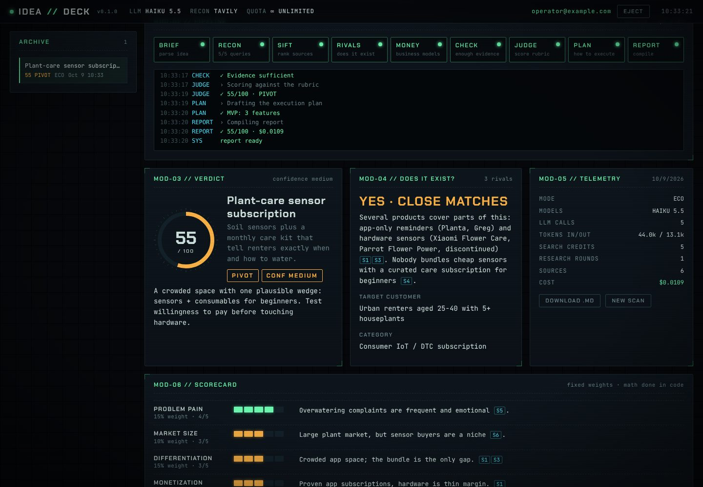

# IsThisIdeaGood · IDEA//DECK

Type in any idea. A small LangGraph pipeline of specialist agents then:

1. **searches the web** to see whether it already exists and who the competitors are,
2. **works out how comparable businesses make money**,
3. **scores the idea** against a fixed 8-criterion rubric, citing sources (the math is done in code, not by the LLM),
4. **writes an execution plan**: the wedge, MVP scope, a validation test you can run this week, first customers, pricing and 30/60/90 days.

It runs on a small VPS, costs about **$0.02 per idea** (ECO mode) or **$0.13** (DEEP mode), and sits behind a whitelist login with a cyberdeck-style one-page UI.



## Install on a VPS (one line)

On a fresh Debian or Ubuntu server:

```bash
curl -fsSL https://raw.githubusercontent.com/artenl/IsThisIdeaGood/HEAD/install.sh | sudo bash
```

The installer:

- installs Docker if it's missing and clones this repo to `/opt/isthisideagood`,
- asks for your **Anthropic API key** ([console.anthropic.com](https://console.anthropic.com/settings/keys)) and your **Tavily API key** ([app.tavily.com](https://app.tavily.com), 1,000 free searches a month),
- asks for an **admin email and password**. The admin is whitelisted with unlimited runs, and only a hash of the password is stored,
- asks for a **domain**. If you give one, Caddy fetches a Let's Encrypt certificate and serves HTTPS on 80/443. Without one, the app is served over plain HTTP on port 8080,
- builds and starts everything with Docker Compose.

**Updating:** re-run the same command. Your `.env` and database are kept. Use `RECONFIGURE=1` to change keys, domain or admin.

**Non-interactive:** put the answers after `sudo`:

```bash
curl -fsSL https://raw.githubusercontent.com/artenl/IsThisIdeaGood/HEAD/install.sh | sudo \
  ANTHROPIC_API_KEY=sk-ant-... TAVILY_API_KEY=tvly-... \
  ADMIN_EMAIL=you@example.com ADMIN_PASSWORD='choose-a-strong-one' \
  DOMAIN=ideas.example.com bash
```

Use `DOMAIN=-` for no domain. If ports 80/443 are already taken by another web server, the installer binds the app to `127.0.0.1:8000` so you can point your existing proxy at it.

Your provider's firewall must allow ports 80 and 443 (or 8080 without a domain).

### Sharing an existing Caddy

If another project's Caddy container already holds ports 80/443, let it route a hostname to this app:

```bash
# 1. Join that Caddy's Docker network (find it with: docker inspect <caddy-container>)
cd /opt/isthisideagood
cat > docker-compose.override.yml <<'EOF'
services:
  app:
    networks:
      default: {}
      proxy:
        aliases: [isthisideagood]
networks:
  proxy:
    external: true
    name: <caddy-network>
EOF
docker compose up -d

# 2. Add a site to that Caddy's Caddyfile, then reload it
#    ideas.example.com {
#        reverse_proxy isthisideagood:8000 {
#            flush_interval -1
#        }
#    }
docker exec <caddy-container> caddy reload --config /etc/caddy/Caddyfile --adapter caddyfile
```

Caddy gets the HTTPS certificate on its own. `docker-compose.override.yml` is git-ignored, so updates keep it.

## Access control

- Only **whitelisted emails** can use the app. Anyone else who signs in sees a "Coming soon" screen, and their email goes on a waitlist.
- **Admins** have unlimited runs. Other whitelisted users get a monthly quota (default 10).
- After 5 failed logins an email is locked for 15 minutes. An IP is locked after 20 attempts.
- The site sends `noindex` headers and has a `robots.txt` that disallows crawling. The API docs endpoints are disabled.

Manage users from the server:

```bash
cd /opt/isthisideagood
docker compose exec app idea-eval users add friend@example.com --limit 10   # whitelist a user
docker compose exec app idea-eval users add you@example.com --admin         # admin = unlimited
docker compose exec app idea-eval users passwd you@example.com              # change a password
docker compose exec app idea-eval users list
docker compose exec app idea-eval users remove friend@example.com
docker compose exec app idea-eval waitlist                                  # who got "coming soon"
```

## How it works

```
START → brief ─▶ search ×N (parallel) → gather ─▶ competitor_analyst ┐
                   ▲                         └─▶ business_analyst   ┴─▶ evidence_check
                   └──────── follow-up queries (max 1 extra round) ◀──────────┤
                                                                              ▼
                                                     judge → strategist → report → END
```

| Node | What it does | Model |
|------|--------------|-------|
| `brief` | Turns the idea into a research brief and 4–6 search queries | Haiku 5.5 |
| `search` | Runs one Tavily search per query, in parallel (`Send` fan-out), cached for 7 days | none |
| `gather` | Dedupes, ranks and caps sources (max 3 per domain) | none |
| `competitor_analyst` | Answers "does it exist?", maps competitors, gaps and demand signals | Haiku 5.5 |
| `business_analyst` | Revenue models, price points, unit economics, market signals | Haiku 5.5 |
| `evidence_check` | Runs one more search round if the evidence is thin | none |
| `judge` | Writes a pre-mortem, then scores 8 criteria with citations | Haiku 5.5, or Sonnet 5.5 in DEEP mode |
| `strategist` | Writes the execution plan | Haiku 5.5, or Sonnet 5.5 in DEEP mode |
| `report` | Weighted score, verdict and confidence, computed in Python | none |

Every LLM call uses Claude structured outputs (`json_schema`) with Pydantic schemas. Web content is treated as untrusted data, and the judge has to cite sources for any score above 3. See [PLAN.md](PLAN.md) for the design, rubric and cost model.

### Cost per idea (estimates)

| Mode | Models | LLM cost | Search |
|------|--------|----------|--------|
| ECO (default) | Claude Haiku 5.5 everywhere | ≈ $0.02 | 4–9 Tavily credits (free tier: 1,000/month) |
| DEEP | Haiku 5.5 research, Sonnet 5.5 judge + plan | ≈ $0.13 | same |

The UI shows the actual token use and cost of every run.

## Configuration

Settings live in `/opt/isthisideagood/.env`. See [.env.example](.env.example) for every option: models, effort levels, search caps, user quotas and an optional global monthly budget. Apply changes with `docker compose up -d`.

## Local development

```bash
uv sync                        # Python 3.12+
cp .env.example .env           # add your keys
uv run idea-eval run "a marketplace for renting camping gear between neighbours"
uv run idea-eval run "..." --deep --out report.md
uv run idea-eval users add you@example.com --admin
uv run idea-eval serve         # http://127.0.0.1:8000
uv run pytest                  # offline: Claude and Tavily are faked
uv run ruff check src tests
```

## Project layout

```
src/idea_eval/
  graph.py      LangGraph wiring + run_pipeline()
  nodes.py      node functions (dependency-injected LLM + search)
  prompts.py    system prompts
  schemas.py    Pydantic schemas for every LLM output
  scoring.py    rubric, weighted score, verdict, confidence
  llm.py        Claude via langchain-anthropic, cost ledger
  search.py     Tavily client with SQLite cache
  web.py        FastAPI: auth, runs API, SSE progress, security headers
  runs.py       background runs + event fan-out
  db.py         SQLite (users, runs, cache, waitlist)
  auth.py       scrypt password hashing, login rate limiter
  cli.py        idea-eval command
  static/       the one-page UI (vanilla JS, no build step)
install.sh      one-line installer
docker-compose.yml, Dockerfile, deploy/Caddyfile
```
